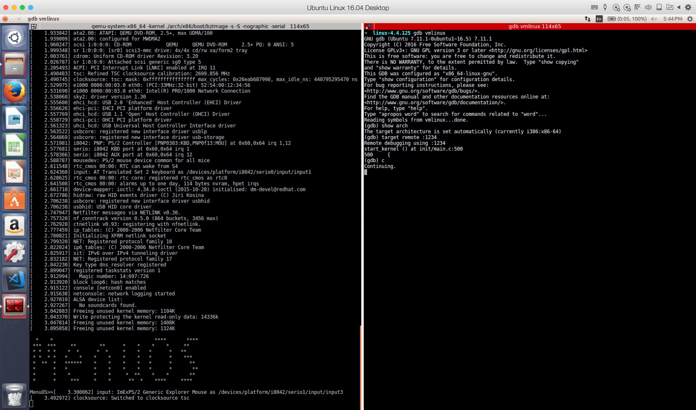
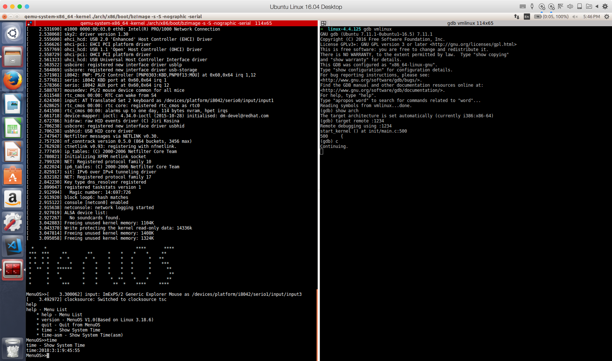

# Lab01 实验报告
## 实验内容：
使用调试跟踪工具，追踪自己的操作系统（建议Linux）的启动过程，并找出其中至少两个关键事件。
## 环境搭建：
### 下载安装
- 系统环境：Ubuntu 16.04 LTS
- 内核版本：Linux-4.4.125
    ```shell
      # kernel.org 下载Linux内核，点击tarball，下载得到 .tar.xz文件
    ```
- QEMU版本：QEMU emulator version 2.5.0
    ```shell
      sudo apt-get install qemu
    ```
- gdb版本：GNU gdb 7.11.1(系统自带)
- make版本：GNU make 4.1（系统自带）
- gcc版本：5.4.0（系统自带）
### 第一步：编译下载好的Linux内核
- 
    ```shell
    mkdir LinuxKernel
    # 把下载的linux-4.4.125.tar.xz复制到/LinuxKernel文件夹
    tar -d linux-4.4.125.tar.xz
    tar -xvf linux-4.4.125.tar
    cd linux-4.4.125
    # 创建 x86_64 的默认内核配置
    make x86_64defconfig
    # 手动配置内核选项
    make menuconfig
    # 进入图形化设置界面
    # 1.取消 Processor type and features -> Build a relocatable kernel
    #   取消后 Build a relocatable kernel 的子项 Randomize the address of
    #   the kernel image (KASLR) 也会一并被取消
    # 2.打开 Kernel hacking -> Compile-time checks and compiler options 下#   的选项：
    #   Compile the kernel with debug info
    #       Generate dwarf4 debuginfo
    #   Compile the kernel with frame pointers
    # 完成设置后save为 .config 之后exit即可
    # 设置完成后即可开始编译
    make -j 8
    # 用8个线程编译，加快编译速度
    # 编译需要一段时间，编译完成后，内核的位置为 ./arch/x86/boot/bzImage
    ```
    - 遇到的问题和解决：
        - make menuconfig时提示报错：“fatal error: 没有那个文件”，使用apt install ncurses-devel命令安装该库，没有，然后又使用apt install ncurses，还是没有该库。根据[https://blog.csdn.net/WANG__RONGWEI/article/details/54846759]()
        ncurses-devel库在Ubuntu中以‘libncureses5-dev’命名，只需：
        ```shell
         sudo apt-get install libncurses5-dev
        ```
### 第二步：制作根文件系统
- 
    ```shell
    cd ..
    mkdir rootFileSystem
    git clone https://github.com/mengning/menu.git
    cd menu
    gcc -o init linktable.c menu.c test.c -m32 -static -lpthread
    # init是系统启动后默认启动1号进程，init是第一个用户态进程，
    # 第一个用户态进程是1号进程
    cd ../rootFileSystem
    cp ../menu/init ./ 
    # 把init拷贝到rootFileSystem目录下边
    find . | cpio -o -Hnewc |gzip -9 > ../rootFileSystem.img
    # 使用cpio方式把当前rootfs目录下所有的文件打包成rootfs.img一个镜像文件
    # 至此一个最简单的根文件系统镜像制作完毕
    ```
## 调试Linux内核
### 第一步：qemu启动内核
- 
    ```shell
    cd /path/to/linux-4.4.125
    # 选项说明
    # -m 指定内存数量
    # -kernel 指定 bzImage 的镜像路径
    # -s 等价于 -gdb tcp::1234 表示监听 1234 端口，用于 gdb 连接
    # -S 表示加载后立即暂停，等待调试指令。不设置这个选项内核会直接执行
    # -nographic 以及后续的指令用于将输出重新向到当前的终端中，这样就能方便的用滚屏
    # 查看内核的输出日志了。
    # -initrd 指向根文件系统镜像
    qemu-system-x86_64 -kernel ./arch/x86/boot/bzImage -s -S -nographic -serial mon:stdio -append "console=ttyS0" -initrd ../rootFileSystem.img
    ```
    这个时候 qemu 会进入暂停状态，如果需要打开 qemu 控制台，可以输入CTRL + A 然后按 C。

- 
    在另一个终端中执行gdb，推荐使用terminator，分屏查看很好用。
    ```shell
    cd /path/to/linux-4.4.125
    gdb vmlinux
    # vmlinux 是编译内核时生成的调试文件，在内核源码的根目录中。
    # 进入 gdb 的交互模式后，首先执行
    gdb show arch
    # 当前架构一般是: i386:x86-64
    # 连接 qemu 进行调试：
    target remote :1234
    # 设置断点
    # 如果上面qemu是使用 qemu-kvm 执行的内核的话，就需要使用 hbreak 来设置断点，否则断点无法生效。
    # 但是我们使用的是 qemu-system-x86_64，所以可以直接使用 b 命令设置断点。
    b start_kernel
    # 执行内核
    c
    ```
    执行内核后gdb会出现一个错误：
    ```shell
    Remote 'g' packet reply is too long: 后续一堆的十六进制数字
    ```
    解决方法：
    ```shell
    # 断开 gdb 的连接
    disconnect
    # 重新设置 arch
    # 此处设置和之前 show arch 的要不一样
    # 之前是  i386:x86-64 于是改成  i386:x86-64:intel
    set arch i386:x86-64:intel
    # 重新连接
    target remote :1234
    ```
    连接上后就可以看到 gdb 正常的输出 start_kernel 处的代码，然后按照 gdb 的调试指令进行内核调试即可。
    ```shell
    (gdb) target remote :1234
    Remote debugging using :1234
    start_kernel () at init/main.c:500
    500	{
    ```
    按c继续执行内核程序，内核启动成功后停止
    输入help可以查询指令

    
    
### gdb调试
#### 关键事件一————start_kernel()
- 输入list查看start_kernel附近的代码：
    ```shell
    (gdb) b start_kernel
    (gdb) c
    (gdb) target remote :1234
    Remote debugging using :1234
    start_kernel () at init/main.c:500
    500	{
    (gdb) list
    495		ioremap_huge_init();
    496		kaiser_init();
    497	}
    498	
    499	asmlinkage __visible void __init start_kernel(void)
    500	{
    501		char *command_line;
    502		char *after_dashes;
    503	
    504		/*
    ```
#### start_kernel()分析
- 在构架相关的汇编代码运行完之后，程序跳入了构架无关的内核C语言代码：init/main.c中的start_kernel函数，在这个函数中Linux内核开始真正进入初始化阶段，进行一系列与内核相关的初始化后，调用第一个用户进程－init 进程并等待用户进程的执行，这样整个 Linux 内核便启动完毕。该函数所做的具体工作有：
    1) 调用 setup_arch()函数进行与体系结构相关的第一个初始化工作；对不同的体系结构来说该函数有不同的定义。对于 ARM 平台而言，该函数定义在arch/arm/kernel/Setup.c。它首先通过检测出来的处理器类型进行处理器内核的初始化，然后通过 bootmem_init()函数根据系统定义的 meminfo 结构进行内存结构的初始化，最后调用paging_init()开启 MMU，创建内核页表，映射所有的物理内存和 IO空间。
    
    2) 创建异常向量表和初始化中断处理函数；
    
    3) 初始化系统核心进程调度器和时钟中断处理机制；
    
    4) 初始化串口控制台（serial-console）；
    
    5) 创建和初始化系统 cache，为各种内存调用机制提供缓存，包括;动态内存分配，虚拟文
    件系统（VirtualFile System）及页缓存。
    
    6) 初始化内存管理，检测内存大小及被内核占用的内存情况；
    
    7) 初始化系统的进程间通信机制（IPC）
#### 关键事件二————rest_init()
- 
    ```shell
    (gdb) b rest_init
    Breakpoint 2 at 0xffffffff81892990: file init/main.c, line 388.
    (gdb) c
    Continuing.

    Breakpoint 2, rest_init () at init/main.c:388
    388	{
    (gdb) list
    383	 */
    384	
    385	static __initdata DECLARE_COMPLETION(kthreadd_done);
    386	
    387	static noinline void __init_refok rest_init(void)
    388	{
    389		int pid;
    390	
    391		rcu_scheduler_starting();
    392		smpboot_thread_init();
    ```
#### rest_init()分析
- 在内核初始化函数start_kernel执行到最后，就是调用rest_init函数，这个函数的主要使命就是创建并启动内核线程init。